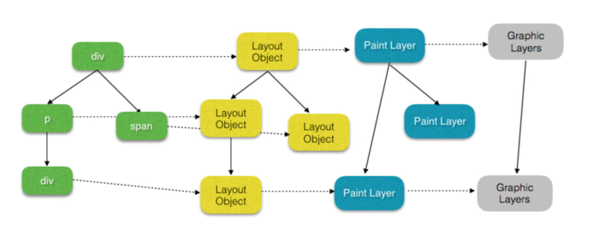

## 浏览器渲染-composite layer 相关

以 chrome (blink) 为例,几个概念性对象:

LayoutObject: parse(dom + style)
PaintLayer: (RenderLayer). 拥有相同的坐标空间的 LayoutObjects，属于同一个渲染层.
         独立渲染层, 条件?
         渲染层提升为 **合成层** (Compositing Layers), 条件(直接的,后代的,重叠的)? 优势?及过度使用性能反例
GraphicsLayers:
         合成层层压缩, 层爆炸

* 合理利用 合成层,及合成层压缩 ,避免层爆炸💥

- [浏览器内核渲染：重建引擎 - 掘金](https://juejin.im/post/5bbaa7da6fb9a05d3761aafe?utm_medium=fe&utm_source=weixinqun)
- [无线性能优化：Composite](http://taobaofed.org/blog/2016/04/25/performance-composite/)
- [假定重叠](https://github.com/yoution/AssumedOverlap)
- [浏览器渲染流程 Composite（渲染层合并） ](https://segmentfault.com/a/1190000014520786)
- [谈谈一些有趣的CSS题目（21）-- 提高 CSS 动画性能的正确姿势 | 盒子端 CSS 动画性能提升研究](https://github.com/chokcoco/iCSS/issues/11)

### fixed

浏览器在没有 scroll 或层叠情况下, fixed 的 div 并不会提升为合成层.