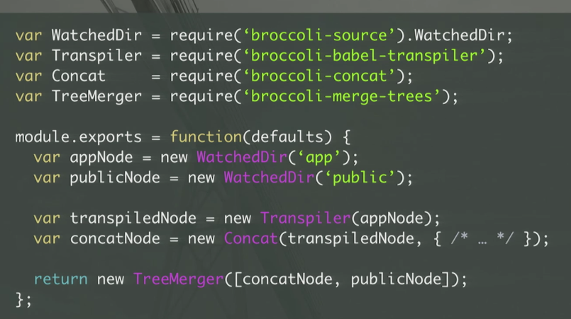

## Broccoli


[start](https://codesandbox.io/s/broccoli-tutorial-1ijph)


```
app                                                       [target]
 ├─ src                                                    │
 │   ├─ index.js   --> ConcatPlugin() ┐                    │
 │   └─ other.js                      ├─ MergePlugin() --> ├─ prod.js
 └─ styles                            │                    └─ site.css
     ├─ site.scss  --> SassPlugin() ──┘
     └─ layout.scss

```


### thinking in broccoli

three concepts:

- directories

- plugins

- trees

> Broccoli itself doesn’t really care about files, it simply takes source directories and passes them as inputs to plugins, creates an output directory for the plugin to write to, and passes that output directory as an input to the next plugin.

> A broccoli-plugin has only one purpose, to transform the files from its this.inputPaths directories to its this.outputPath directory when its build() function is invoked.

> the build pipeline looks like a broccoli(tree)
tree is a graph of nodes, each of which can represent either an input or a transformation that we want to perform. In other words, tree is an abstract set of operations, not a concrete set of output files.


### vs gulp/grunt (task runner)

- not file, based tree
- input and output is tree
- can figure out which files need rebuild by dependencies .(grunt dont know this, so rebuild all )
- like gulp, in a code logic way, instead of grunt's conf look .


## ember-cli

base: /broccoli/ember-app.js

EmberApp:



### refs

- [EmberConf 2016: Dissecting an Ember CLI Build by Estelle DeBlois](https://www.youtube.com/watch?v=hNwgp9alwKg&t=826s)