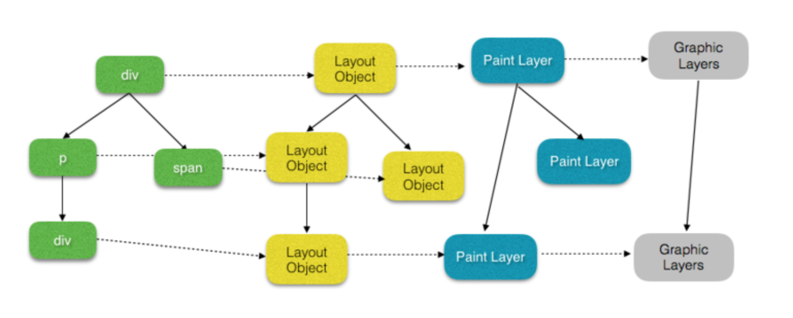

## 浏览器渲染-composite layer 相关

以 chrome (blink) 为例,几个概念性对象:

LayoutObject: parse(dom + style)
PaintLayer: (RenderLayer). 拥有相同的坐标空间的 LayoutObjects，属于同一个渲染层.
         独立渲染层, 条件?
         渲染层提升为 **合成层** (Compositing Layers), 条件(直接的,后代的,重叠的)? 优势?及过度使用性能反例
GraphicsLayers:
         合成层层压缩, 层爆炸

* 合理利用 合成层,及合成层压缩

- [ 浏览器内核渲染：重建引擎 - 掘金](https://juejin.im/post/5bbaa7da6fb9a05d3761aafe?utm_medium=fe&utm_source=weixinqun)
- [无线性能优化：Composite](http://taobaofed.org/blog/2016/04/25/performance-composite/)
- [假定重叠](https://github.com/yoution/AssumedOverlap)