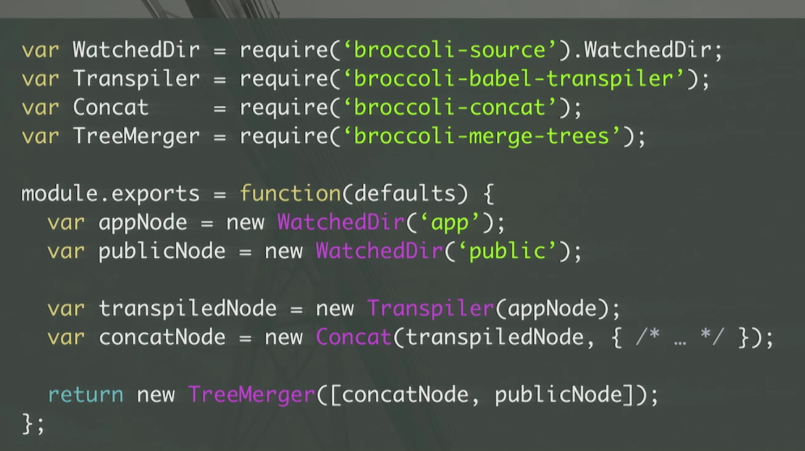

## Broccoli

### vs gulp/grunt (task runner)

- not file, based tree , tree is a directory with files
- input and output is tree
- can figure out which files need rebuild by dependencies .(grunt dont know this, so rebuild all )
- like gulp, in a code logic way, instead of grunt's conf look .

## ember-cli

base: /broccoli/ember-app.js

EmberApp:

### refs

- [EmberConf 2016: Dissecting an Ember CLI Build by Estelle DeBlois](https://www.youtube.com/watch?v=hNwgp9alwKg&t=826s)