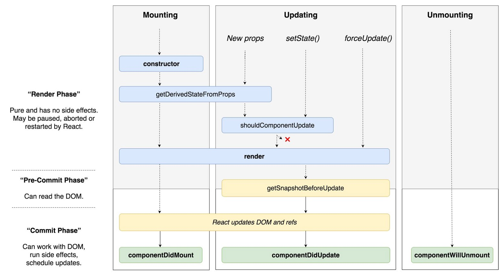

> UI=f(state)

由于vdom的存在，可以非常纯粹地把视图逻辑作为一般性的逻辑来组织代码。单向数据流应运而生。

## component lifecycle


## 编码规范

- [Airbnb React编码规范](https://zhuanlan.zhihu.com/p/20616464)
- [eslint config airbnb](https://github.com/airbnb/javascript/tree/master/packages/eslint-config-airbnb)
- [krasimir/react-in-patterns](https://github.com/krasimir/react-in-patterns)


## perf

> ** don't be premature optimization! **

- [react 15.4.0 profiling](https://facebook.github.io/react/blog/2016/11/16/react-v15.4.0.html#profiling-components-with-chrome-timeline)

### good perf blog

- [part1](http://benchling.engineering/performance-engineering-with-react/)
- [part2](http://benchling.engineering/deep-dive-react-perf-debugging/)

- [react/redux pref tips](https://medium.com/@arikmaor/react-redux-performance-tuning-tips-cef1a6c50759)
- [react-is-slow-react-is-fast](https://marmelab.com/blog/2017/02/06/react-is-slow-react-is-fast.html)
- [Function as Child Components!!(render props , replace hoc)](https://m.okjike.com/messages/5a843f1924b3cd00119a6ea3?username=9b5080c9-39df-4b6c-be7f-92a9b48872f0)

> **renderProps** 的核心思想是，通过一个函数将class组件的state作为props传递给纯函数组件 (https://www.jianshu.com/p/ff6b3008820a)
> **理解: 组件只是注入功能,而不用关心如何作用于 UI!**
> 相关: - [精读《Epitath 源码 - renderProps 新用法》 - 掘金](https://juejin.im/post/5bc3ed11e51d450e452aff73)


### some libs / tools

  - [PureComponent]()

    `shouldComponentUpdate` 不要滥用，注意本身执行也是要影响性能的。

  - [recompose](https://github.com/acdlite/recompose)是一个更好支持函数式组件定义的HOC.提供了很多优化性能的HOCs

    `pure`、`shouldUpdate`、`onlyUpdateForKeys` 方法可替代PureComponent 。

  - [moize](https://github.com/planttheidea/moize#usage-with-functional-react-components) | [memoize decorator](https://github.com/andreypopp/memoize-decorator)

    对于一些 ** expensive & frequent value compute ** , 可以采用 memoize 策略缓存起来。

    or  lodash.memoize , [reselect]()


  - [why-did-you-update (for dev warning)](https://github.com/garbles/why-did-you-update)

  - [react-addons-perf 分析工具](https://facebook.github.io/react/docs/perf.html)


### react-route  (multiple root router for plain route object)

```
{
  path        : '/',
  indexRoute  : { component: Dashboard },
  childRoutes : [
    {
      // path: 'login',
      component:  EmptyLayout,
      childRoutes: [
        loginRoute(store)
      ]
    },
    {
      component   : CoreLayout, // extends AuthComponent
      childRoutes: [
        dashboardRoute(),
        testRoute()
      ]
    },{
      path : '*',
      component: NotMatch
    }
  ]
}
```


### for component

- [react-patterns-render-callback](https://leoasis.github.io/posts/2017/03/27/react-patterns-render-callback)
- [react-higher-order-components-in-depth](https://medium.com/@franleplant/react-higher-order-components-in-depth-cf9032ee6c3e)
- [深入理解 React 高阶组件](https://mp.weixin.qq.com/s?__biz=MzAwNTAzMjcxNg==&mid=2651424813&idx=1&sn=71407be9eba05e951d8731e29dc82154&chksm=80dff64eb7a87f588c9170ce9b3ff7d3ae8c081fe841c3c2cde193a14e36e739aa5bbd7a53f6&mpshare=1&scene=1&srcid=0112FGt5IqX01nKgBqk7D1YY&key=de9885d92edfb0d73d7d79564c0ca2f1303ed4ea9cf995ed2df14d37b5931b5e4a76e5cae1c2de187380ebbdb79302459e0a81c00980905659fe50e6c2af72c8ee4558a1cda2b2997c3a8f0677c48ea5&ascene=0&uin=MjA0ODAxOTEwMw%3D%3D&devicetype=iMac+MacBookPro12%2C1+OSX+OSX+10.12.2+build(16C67)&version=12010210&nettype=WIFI&fontScale=100&pass_ticket=AXtjIp9xosyMvsOYoXCvywGQhDuBDUj4cNfGNkV5%2FEUcfgFq0r%2BR%2Bx8gdmvSn86k)
- [深入理解 React、Redux - 前端 - 掘金](https://juejin.im/entry/56ea5f24731956005d029ca6)
- [React is Slow, React is Fast: Optimizing React Apps in Practice](https://marmelab.com/blog/2017/02/06/react-is-slow-react-is-fast.html)

#### ref 运用

- 通过ref 获取子组件实例，见 [深入理解 React 高阶组件].

 why ref callback? (1: for  functional component, 2: = null  when component destroy,3: use dom element in callback only ,4 : get child dom in parent)
 https://zhuanlan.zhihu.com/p/33596370


#### displayName


## animate

- https://mp.weixin.qq.com/s/ogIoHMI79HINuiV5y1rUwA


