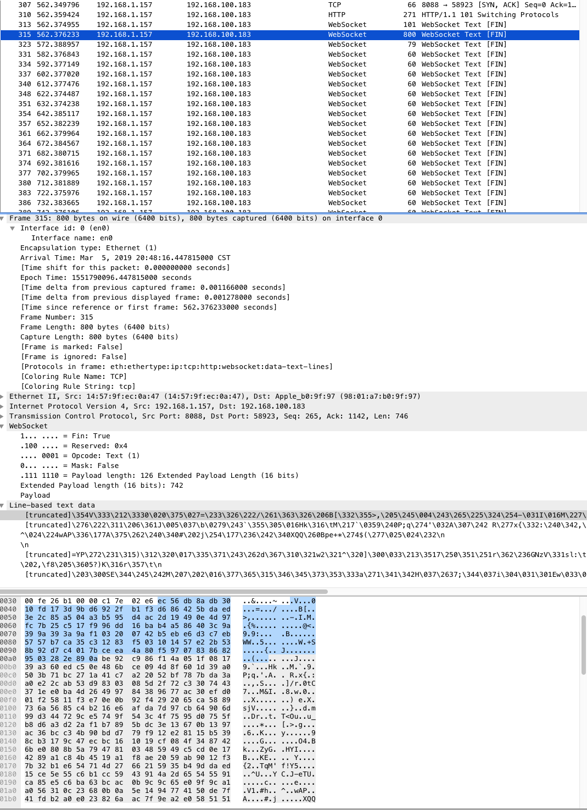
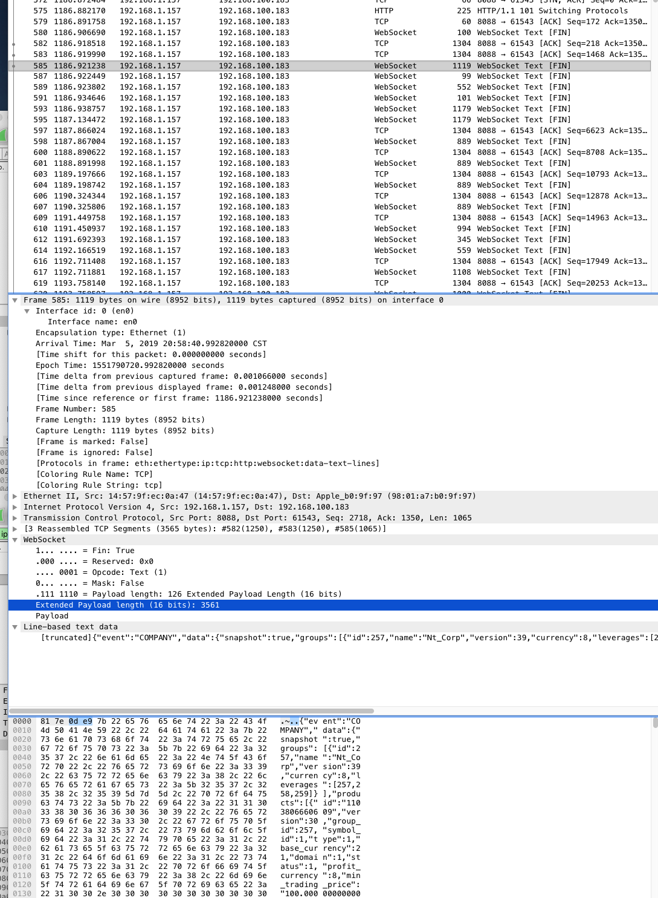

## Sec-WebSocket-Extensions

启用 `Sec-WebSocket-Extensions: permessage-deflate; client_max_window_bits` 前后, 流量压缩效果对比

Sec-WebSocket-Extensions是客户端用来与服务端协商扩展协议的字段，permessage-deflate 表示协商是否使用传输数据压缩，client_max_window_bits 表示采用 [LZ77](https://www.jianshu.com/p/89dd96537d9d) 压缩算法时，滑动窗口相关的 SIZE 大小。

## Sec-

- [深入理解跨站点 WebSocket 劫持漏洞的原理及防范](https://www.ibm.com/developerworks/cn/java/j-lo-websocket-cross-site/index.html)

### refs

- [印象笔记-websocket](https://app.yinxiang.com/Home.action#n=1fe76c6b-ed25-4a5f-8dc4-66ee5d9863b0&s=s10&ses=1&sh=5&sds=5&x=websocket&)
